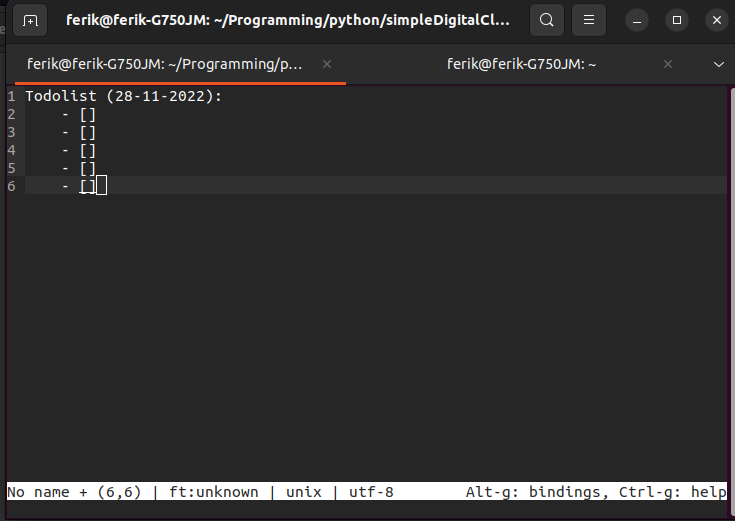

# Simple-Todolist-Generator-bash
Basically it's an automatic Todolist generator which create :
1. Create a folder on ~home
2. Create a txt todolist with a format (todolist-hari-bulan-tahun.txt)
3. Automaticly open an text editor

# To run
```bash
./todolist.sh
```

# Screenshoot

